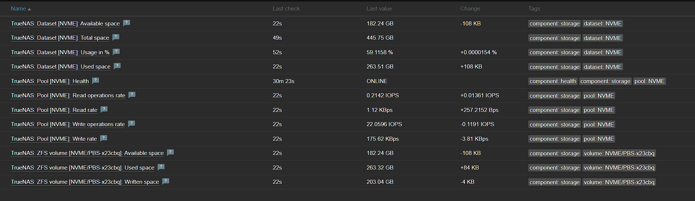

# zabbix_truenas_SCALE_snmp
Zabbix monitoring template for truenas scale 25.10.4 &amp; higher

## Overview
Template for monitoring TrueNAS SCALE by SNMP. Based on the original of: https://git.zabbix.com/projects/ZBX/repos/zabbix/browse/templates/app/truenas_snmp?at=release/6.0
The version combination of zabbix & truenas has been evolving over the last few months. I am not able to test backwards compatibility.

As per the comment in this issue: [https://ixsystems.atlassian.net/browse/NAS-120434](https://ixsystems.atlassian.net/browse/NAS-120434?focusedCommentId=181336), Truenas SCALE changed a lot of SNMP and thus OID names in version 22.12.1. This resulted in many broken monitoring data.

I tried reaching out via the forum & reddit to get this resolved, but never got any support or interest in this. I decided to work on this for personal usage & hope to help someone else with this too.

Mid 2026 the community made me aware that truenas had been updated and was shipping with an updated MIBS file. Based on this, I was able to make some updates to monitor Dataset, pools & volumes again.

**NOTE:** I had to delete certain logic in this, since with the new SNMP data the pools no longer share data usage statistics. I had to monitor this on datasets using some calculated fields and the available data. I have built a rule to only do this on the "root" datasets (so no sub datasets/folders) as my logic would only work for those based on the available fields in SNMP I could find. Since I am also not using truenas in a professional context, I had to disable L2ARC monitoring, since I have no way to test this.

> I am open for pull requests if others are using more complex setups and can find a working solution for their set-up.

### What works in the latest version
On top of the standard monitoring like CPU, Memory, ARC, interfaces, ..., this now also supports:
- [x] Monitoring of a ZPool (Health, Read operations rate, Read rate, Write operations rate, Write rate)
- [x] Monitoring of a Dataset (Available space, Total space, Usage in %, Used space)
- [x] Monitoring of a ZVOL (Available space, Used Space, Written space)

## Requirements
Zabbix version: 7.4 and higher.

## Tested versions
This template has been tested on:

- TrueNAS-25.10.4 with Zabbix 7.4.11

## Setup
- Import the template into Zabbix.
- Enable SNMP daemon at Services in TrueNAS web interface: https://www.truenas.com/docs/core/uireference/services/snmpscreen/
- Link the template to the host.

### Additional macro
- {$DATASET.ROOT} was added with default value `^(.+\/(.+))` to ensure only the root dataset would get marked for the item prototype.
